<div align="center">

# 💼 Career-Ops Finance-CN

### 中国私募 · 金融行业 AI 求职系统

**别再给上百家机构海投简历。<br>让 AI 从 <kbd>134 家</kbd> 中国 / 香港私募 · 投资机构里，替你挑出真正值得投的那几家。**

*"金融/私募版的 [career-ops](https://github.com/santifer/career-ops)" —— 券商用 AI 筛简历；这个工具把 AI 交给金融人，反过来去 **挑** 机构。*



[](https://github.com/santifer/career-ops)
[](LICENSE)


**简体中文** · [English](README.en.md)（WIP）

</div>

---

> **⭐ 先点个 Star** —— 134 家雇主库每逢更新（新机构 / 新招聘季 / 新面经）你会第一时间看到，也方便日后找回来。

## 目录
[这是什么](#这是什么) · [缘起](#缘起) · [覆盖版图](#️-覆盖版图--别处没有的东西) · [怎么用](#-怎么用) · [真实场景](#-它能帮你做什么) · [隐私](#-你的数据永远是你的) · [路线](#-定位与路线-a--b) · [一起做全](#-一起把它做全) · [致谢](#-致谢--license)

## 这是什么

[Career-Ops](https://github.com/santifer/career-ops)（**57k⭐** 的开源 AI 求职系统）本身很强——但它**不懂中国金融圈**：不知道某头部信托在招什么、某券商系 PE 的 careers 页在哪、"投资法务"这种岗位该怎么筛。

**Career-Ops Finance-CN 把它武装成懂中国私募 / 金融行业的样子：**

- 📇 **134 家机构雇主库**（14 大类）—— 每家带 careers 链接、办公城市、行业标签
- 🎯 **中英双语岗位筛选词典**（76+ 正向词）—— 投资法务 / 合规 / 风控 / 投资 / 研究 …
- 🀄 **中文金融求职 & 面试模式** + 金融方向 Profile 模板

> 一句话：**career-ops 是引擎，这里是给中国金融人的燃料。**

## 缘起

> 这个项目源于一次真实的中国金融求职。
> 与其给上百家机构海投、石沉大海，不如让 AI 从对口的机构里精挑几家、逐一打透。
> 作者把求职时打磨出来的这套配置，**脱敏后开源**——
> 因为在找工作那会儿，市面上没有一个真正懂中国金融圈的这种工具。

## 🗺️ 覆盖版图 —— 别处没有的东西

> 134 家 · 14 类，从券商系 PE 到国家级母基金，一张中国私募 / 另类投资的求职地图。

| 类别 | 家数 | · | 类别 | 家数 |
|---|:--:|:--:|---|:--:|
| 券商系私募 | 9 | · | 外资私募 | 8 |
| 银行系私募 | 9 | · | 信托公司（深圳分部）| 4 |
| 公募系私募 | 9 | · | 产业投资 / CVC | 8 |
| 国资 / 央企私募 | 10 | · | AIC 金融资产投资 | 6 |
| 深圳地方私募 | 7 | · | 保险资管系 | 5 |
| 民营市场化私募 | 10 | · | 家办 / 私行 | 6 |
| REITs / 地产基金 | 7 | · | 政府引导 / 母基金 | 4 |

**覆盖城市：深圳 · 香港**（主战场）+ 北京 · 上海。 每家都在核验来源与更新日期（见 [贡献](#-一起把它做全)）。

## ⚡ 怎么用

三步上手（配置包，套在 career-ops 上）：

```bash
# 1) 先装 career-ops（见它的 README）
# 2) 套上金融配置
cp portals.finance-cn.yml                 <career-ops>/portals.yml
cp config/profile.finance-cn.example.yml  <career-ops>/config/profile.yml   # 填你自己的信息
# 3) 在你的 AI CLI（Claude Code / Codex / Gemini …）里跑：
#    scan（扫岗）→ apply（生成投递）→ followup（跟进）→ interview-prep（面试准备）
```

完整用法见 [docs/USAGE.finance.md](docs/USAGE.finance.md)。

## 🎯 它能帮你做什么

- **应届 / 在读**：一次扫清 134 家的在招岗，AI 按你的背景打分排序，把有限的精力压到最对口的头部私募 / 券商资管上，而不是海投石沉大海。
- **卖方转买方**：用配置包对齐十几家资管 / PE 的 JD 关键词，简历按"deal 经验"重构，面试前用 interview-prep 过一遍买方常问。
- **法律 / 合规背景**：内置投资法务 / 合规 / 风控的岗位词典，直接命中信托 / 基金 / PE 的法务合规岗——这套通用求职工具永远不会有。

## 🔒 你的数据永远是你的

金融求职最敏感的就是隐私。本工具**全程本地运行**：

- 你的简历、deal 记录、求职意向 —— **只留在你本地 / 你的账户**
- 投递材料一律 **draft-only**，绝不自动提交、绝不替你点"申请"
- 雇主库、配置包**可随时导出**，不锁定
- **永不上云**

> 你的 deal 数据和求职意向，不该是别人训练数据的一部分。

## 🧭 定位与路线（A → B）

- **现在（A）**：金融 **法律 / 合规 / 投资法务** 方向 —— 先做深、做可信。
- **成长为 B**：投资 / 研究 / 投行 / 风控 全覆盖 —— 雇主库已就位，扩岗位词即可。

## 🤝 一起把它做全

中国金融圈的雇主信息变化快。目标是做成中文金融圈**最全、最新**的求职雇主库——靠大家一起维护：

- 🏢 **补一家机构** / 🔗 **报个失效链接** / 🏷️ **补岗位词** → 提 [Issue](../../issues/new/choose) 或 PR（一次一家，评审快）
- 🎉 **用它拿到金融 offer 了？** 开个 Issue 分享你的故事（可匿名），帮下一个人
- 📋 每条数据都带 `来源` 和 `核验日期`，CI 自动查死链——欢迎帮我们守住"新鲜度"

## 💬 社区 & 免费资料

**仓库里就有的开放资料**（欢迎 PR 一起补）：
- 📚 [金融面经题库](resources/金融面经题库.md) —— 投行 / PE·VC / 研究 / **投资法务·合规** / 风控 / 香港岗
- 📐 [估值建模模板](resources/估值建模模板.md) —— DCF / 可比公司 / LBO + 金融机构特殊估值
- 📋 [134 家投递追踪表](docs/投递追踪表.md) —— 从雇主库一键导出

关注公众号 **［待建号后填］** 领 **打包 PDF 版 + 更新推送**（回复 `面经` / `估值` / `清单`）。
> 📱 二维码待建号后放 `docs/qrcode.png` ｜ 小红书 / 知乎 ［待填］ 同步金融求职干货。

## 🙏 致谢 & License

构建于 **[Career-Ops](https://github.com/santifer/career-ops)** by [@santifer](https://x.com/santifer)（MIT）—— 感谢开源。若本项目对你有用，也去给上游点个 star。本仓同样以 **MIT** 发布，详见 [NOTICE.md](NOTICE.md)。

> ⚠️ 雇主库仅供求职参考；招聘信息以各机构官方渠道为准。数据均来自公开渠道，不含任何非公开信息。
